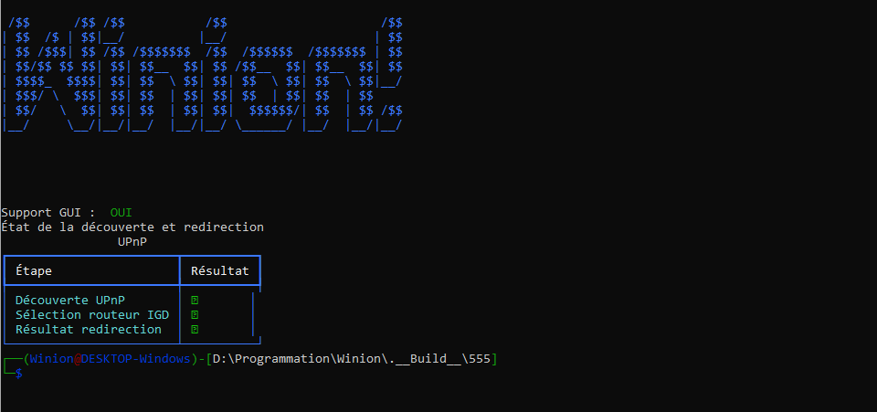

# 🚨⚠️ Face aux propositions de vote à l’UE qui piétinent les droits fondamentaux à l’anonymat et à la liberté, ce logiciel a été publié en urgence, bien plus tôt que prévu. Il est une arme numérique destinée à défendre vos droits et à résister à la surveillance de masse, en fournissant des modules puissants permettant des communications chiffrées de bout en bout, hors d’atteinte de toute censure. ⚠️🚨


[](#)

 		   

 	 


# 🇫🇷 Un Projet 100% Français, et j'en suis extrêmement fier !

Winion est un projet conçu et développé en France, avec passion et enthousiasme. Il s'agit d'un interpréteur de commandes avancé qui apporte l’expérience Linux sur Windows, avec des commandes modifiées et optimisées.

L’objectif de Winion est de rendre l’utilisation des commandes plus rapide, sans recherches complexes, tout en étant accessible aux nouveaux utilisateurs et puissant pour les plus expérimentés. Je suis extrêmement fier de ce travail et ravi de le partager avec la communauté.


## 📜 Licence

Ce projet est protégé par la licence **Creative Commons Attribution - Non Commercial - Pas de Modification 4.0 International (CC BY-NC-ND 4.0)**.

### Que permet cette licence ?

- Utilisation, partage et redistribution libre, sous réserve d’attribution.
- Interdiction d’utilisation commerciale.
- Interdiction de modification ou d’adaptation du contenu.

### Conditions importantes

- **Attribution** : crédit obligatoire à l’auteur.
- **Pas de modification** : redistribution uniquement dans sa forme originale.
- **Non commercial** : usage personnel ou éducatif uniquement.

### Responsabilités et marques

- Le projet est fourni “tel quel”, sans aucune garantie. L’auteur décline toute responsabilité en cas de dommages directs ou indirects.
- L’utilisation du nom, logo ou marques associées est interdite sans permission.

### Redistribution et contact

- Toute redistribution doit inclure cette licence et la mention d’origine.
- Pour une utilisation commerciale ou modification, merci de contacter l’auteur sur Session : getsession@05d6aabf549e3d71180341db6ccaf9cd73f8413d4c88b1031eb7e806bb81ceda02.

---

Pour plus d’informations, consultez la licence officielle :  
[CC BY-NC-ND 4.0 — Voir licence](https://creativecommons.org/licenses/by-nc-nd/4.0/deed.fr)


# ❗️ Winion n'est pas une émulation.
Il ne cherche pas à reproduire un noyau Linux ou à imiter bas niveau un terminal Unix.
C’est une simulation avancée : il recrée l'expérience utilisateur, les comportements des commandes, et les interactions typiques d'un shell Linux, tout en fonctionnant nativement sous Windows.
Les commandes ont été réécrites ou adaptées pour tirer parti des spécificités de l'environnement Windows tout en respectant la logique Unix.
L'objectif est de simuler la logique et l'efficacité d’un shell Unix, sans les lourdeurs d’une virtualisation ou émulation complète.

- ✅ Windows 10/11 uniquement
- ❌ Linux et MacOS non supportés

## Sommaire
- [Présentation](#-un-projet-100-français-et-jen-suis-extrêmement-fier-)
- [Statut du projet](#-actuellement-privé-bientôt-open-source)
- [Fonctionnalités](#-il-permet-de-faire-quoi-)
- [Installation](#-1---installation-et-traduction-)
- [Commandes](#-2---commande)
- [Développeurs](#-3---développeur)
- [FAQ](#-4---faq)
- [Support multilingue](#-5---support-multilingue)
- [Auteurs](#auteurs)
- [Releases](#download-releases)
- [License](#-licence-et-conditions-dutilisation-%EF%B8%8F)


# 🔒 Actuellement Privé, Bientôt Open Source
Winion est pour l’instant un projet privé, mais une fois qu’il aura une communauté assez grande, il passera en open source pour que chacun puisse contribuer et l’améliorer.

# Il permet de faire quoi ?
⚡ Winion : Un Terminal Sans Limites !
Winion est bien plus qu'un simple interpréteur de commandes. Il intègre une simulation d'apt, prend en charge des milliers de modules et repose sur des fournisseurs de packages externes pour offrir une puissance inégalée, il permet d’accéder à tout type de fichiers, logiciels, extensions et contenus, sans aucune exception.

Que ce soit pour installer des programmes, télécharger des fichiers, contourner des restrictions ou explorer des bases de données externes, Winion offre un accès total et illimité à un écosystème gigantesque. 🚀


## 📸 Aperçu

# Video 
[](https://www.youtube.com/watch?v=Q90Vv5hll6k)

# Gestionnaire de Paquets.
Par défaut, Winion utilise [WinionSourceAPT](https://github.com/JuanForge/WinionSourceAPT) comme catalogue principal pour la gestion de paquets. Cela permet d’accéder à une vaste collection de logiciels, extensions et outils, tout en facilitant l'installation et la mise à jour des paquets directement depuis le terminal.


# 1 - 💻 Installation et traduction 🌍


## 💾 Installation recommandée (Release)
📢 Nous recommandons fortement d’utiliser les releases officielles afin de bénéficier d’une version stable, complète et prête à l’emploi.
Téléchargez la dernière version [**ici**](https://github.com/JuanForge/Winion/releases/latest).


## 🛠 Installation alternative (sources Git)
⚠️ Réservée aux développeurs ou contributeurs.
Permet d’obtenir la version en cours de développement (peut contenir des bugs).
```bash
  git clone https://github.com/JuanForge/Winion.git
  cd Winion
  pip install -r requirement-Win.txt
  python Main.py
```

### 🌍 Installer le Module de traduction automatique.
#### 👨‍💻 Depuis le Terminal .

```sh
  apt update --all
  apt install AutoTranslation -y
```

#### 💾 Depuis Git .

```sh
  cd /Module/
  git clone https://github.com/JuanForge/AutoTranslation.git
```


# ⌨️ 2 - Commande

### Helper
#### Voir les commandes disponible :
```sh
help
```


### Voicie les commandes de base :

####  Module :
Mettre à jour les fichiers d’index des dépôts.
```sh
apt update
```

Installer un paquet.
```sh
apt install <module>
```

Supprimer un paquet.
```sh
apt remove <module>
```

Mettre a jour les paquets.
```sh
apt upgrade
```

Mettre a jour le paquet.
```sh
apt upgrade <module>
```

Test complet sur l'entièreté des paquet (Trouver la moindre erreur). ⚠️ ( Plus disponible ) ⚠️
```sh
check integrity
```

Proposse tous les paquets installable, le tous en une interface CLI. ⚠️ ( Plus disponible ) ⚠️
```sh
apt install --CLI
```

####  Autre :

Afficher l'historique des commandes.
```sh
history
```

Permet d'injecter du code python directement dans le programme.
```sh
inject:<code>
```

Purger le système (Vide temp et le Cache). ⚠️ ( Non disponible ) ⚠️
```sh
purge
```

Mets a jour le Software. ⚠️ ( Non disponible ) ⚠️
```sh
sys:update
```

Afficher les information du Software. ⚠️ ( Non disponible ) ⚠️
```sh
sys:version
```

## 🚀 Optimisation

Installe le module d'optimisation des archives. ⚠️ ( Non disponible ) ⚠️

Explication : Sert à installer un module qui vise à optimiser le traitement des archives en remplaçant py7zr ( module interne ) par 7zip ( module externe ) pour accélérer les opérations de compression/décompression.

❗ Veuillez noter que l'installation du module peut nécessiter un peu de patience. En effet, la dépendance principale (7zip) est fournie sous forme de code source, ce qui requiert une phase de compilation. Ce processus peut durer entre 2 et 8 minutes. ❗

```sh
apt install OptiArchive
```


# 👨‍💻 3 - Développeur

## 💾 3.1 - Cache

#### 🔍 inspection :

```python 
inject:with Cache.lock: Cache.inspect()
```

#### 🧹 suppression :

```python 
inject:with Cache.lock: Cache.cache = {}
```
# ❓ 4 - FAQ

### ⚙️ 1 - OS.

#### 1.0 - Winion est-il compatible avec tous les systèmes d'exploitation ?

Winion est actuellement conçu pour Windows (développé principalement sur Windows 10 x64). Il est prévu de créer une version compatible avec Linux dans un futur.


### 🤝 2 - Open Source.
#### 2.0 - Winion est-il open source ?

Pour l’instant, Winion est privé. Il deviendra open source lorsque la communauté sera assez grande pour assurer son développement collaboratif.

#### 2.1 - Quand Winion sera-t-il disponible en open source ?
Winion deviendra open source dès que nous aurons une base solide d’utilisateurs et de contributeurs. Nous souhaitons d’abord assurer une version stable et robuste avant de permettre à la communauté de participer pleinement au développement.

### 🛠️ 3 - amélioration.
#### 3.0 - Puis-je suggérer des améliorations ou signaler des bugs ?

Oui ! Une plateforme de feedback sera mise en place pour permettre aux utilisateurs de proposer des idées et d’aider à l’amélioration du projet.

### 🛡️ 4 - sécurité.

#### 4.0 - Est-ce que Winion remplace l'invite de commandes ou PowerShell ?

Non, Winion ne remplace pas l'invite de commandes ou PowerShell. Il s'agit plutôt d'un complément qui permet d'exécuter des commandes Linux adaptées à Windows pour une utilisation plus rapide et simplifiée, tout en restant compatible avec les outils natifs de Windows.

#### 4.1 - Winion est-il sécurisé à utiliser ?
Oui, Winion est conçu avec la sécurité en tête. Cependant, comme pour tout programme qui interagit avec votre système, il est important de toujours vérifier les sources et de faire preuve de prudence lors de l’utilisation de commandes puissantes. Il est fortement recommandé de ne pas ajouter de sources inconnues dans le gestionnaire de paquets, afin d'éviter d'exécuter des commandes ou d'installer des logiciels potentiellement malveillants.

### 🌐 5 - Support Multilingue.

#### 🌍 5.0 - Support Multilingue à Venir ?
Les traductions dans d’autres langues seront ajoutées plus tard, soit par traduction automatique, soit par la contribution de bénévoles. Restez à l’affût des mises à jour !

#### 🗣️ 5.1 - Langues Prévues

🤖 = Traduction automatique.

🤝 = Traduit par la communauté.

|   Langue   | Prévu | Présent  | Mode de traduction |
|:----------:|:-----:|:--------:|:-------------------:
|  Anglais   |  ✅  |    ❌    |         🤝         |
|  Allemand  |  ✅  |    ❌    |         🤝         |
|  Espagnol  |  ✅  |    ❌    |         🤝         |
|  Italien   |  ❌  |    ❌    |
|  Russe     |  ✅  |    ❌    |         🤖         |
|  Français  |  ✅  |    ✅    |         🤝         |
|  Chinois   |  ❌  |    ❌    |
|  Arabe     |  ❌  |    ❌    |
|  Portugais |  ✅  |    ❌    |         🤖         |
|  Hébreu    |  ❌  |    ❌    |

D'autres langues pourront être ajoutées en fonction des contributions et des demandes de la communauté ! 🌍✨
## Auteurs

- [@WinionByJuan](https://www.tiktok.com/@winionbyjuan)

## Download Releases
| Version     |      Build     |PyVersion|   Date   | Lien |
|:-----------:|:--------------:|:-------:|:--------:|:----:|
| 0.00.01     |08.03.2025.18.00| 3.11.9  |08.03.2025|  ❌  |


# 🛡️ Clause de non-responsabilité (Disclaimer)
Ce logiciel est fourni "tel quel", sans aucune garantie explicite ou implicite, y compris mais sans s’y limiter, les garanties de qualité marchande, d’adéquation à un usage particulier, ou d’absence de virus, de comportements indésirables ou de dommages indirects.

L’auteur, JuanForge, décline toute responsabilité en cas de mauvaise utilisation, d’installation sur des systèmes compromis, ou de modification malveillante par des tiers. Bien que le code source original soit garanti sans composants malveillants à sa publication, l'intégrité de l'œuvre ne peut plus être garantie si le fichier a été altéré, redistribué sans autorisation, exécuté dans un environnement non sécurisé, ou téléchargé à partir de sources non officielles.

## L’auteur ne pourra en aucun cas être tenu responsable

- des pertes de données, corruptions systèmes ou atteintes à l'intégrité logicielle ou matérielle,

- d’un usage frauduleux ou contraire aux lois locales, nationales ou internationales,

- des conséquences liées à des modifications non autorisées, injections de code, ou intégrations tierces non prévues,

- de tout dommage direct ou indirect résultant de l'utilisation de ce programme.

- ⚠️ Toute responsabilité incombe à l'utilisateur final, qui accepte en toute connaissance de cause de l’utiliser à ses risques et périls.

## Il est strictement recommandé

- de télécharger uniquement le logiciel depuis les sources officielles,

- de vérifier l'intégrité des fichiers (checksum, signature, etc.),

- de ne jamais exécuter ce logiciel dans des environnements critiques ou non contrôlés sans précautions suffisantes.

- Par ailleurs, tout comportement illicite utilisant ce programme, même modifié, est strictement interdit et relève de la responsabilité pénale de son utilisateur. En aucun cas l’auteur ne saurait être tenu pour complice ou co-responsable de telles actions.


# 📜 Licence et conditions d’utilisation ⚖️
Ce projet est protégé par la licence Creative Commons Attribution - Non Commercial - Pas de Modification 4.0 International (CC BY-NC-ND 4.0).

## Ce que cela signifie concrètement
Attribution obligatoire
Toute utilisation, partage ou distribution de ce projet doit impérativement mentionner de manière claire et visible l’auteur original Juan ainsi que le nom du projet Winion.

Interdiction d’usage commercial
Ce projet ne peut en aucun cas être utilisé à des fins commerciales, y compris la vente, la monétisation directe ou indirecte, ou toute activité générant un profit.

Pas de modifications autorisées
Il est strictement interdit de modifier, adapter, transformer ou créer des œuvres dérivées basées sur ce projet. Toute redistribution doit se faire dans son état original, sans aucune altération.

Redistribution permise uniquement en version originale
Vous êtes libre de partager ce projet avec d’autres, mais uniquement sous la forme complète et inchangée fournie ici.

Protection juridique et non-responsabilité
Ce projet est fourni « tel quel », sans garantie d’aucune sorte. L’auteur décline toute responsabilité quant à l’usage qui pourrait en être fait, y compris en cas de détournement ou d’usage malveillant.

Ce que vous ne pouvez pas faire :
Utiliser ce projet pour en tirer un profit commercial.

Modifier ou adapter ce projet sous quelque forme que ce soit.

Distribuer une version modifiée ou partielle de ce projet.

Omettre d’attribuer clairement ce travail à l’auteur original.

Sanctions en cas de non-respect

Le non-respect des conditions d’utilisation et de la licence CC BY-NC-ND 4.0 constitue une violation grave des droits de l’auteur, et expose l’utilisateur à des poursuites judiciaires fermes et rapides, sans négociation possible.
    L’auteur (JuanForge) se réserve expressément le droit d’engager facilement des actions légales sans délai et avec détermination pour faire valoir ses droits et protéger l’intégrité de son œuvre,
### de toutes les actions légales nécessaires pour
- protéger ses droits d’auteur,
    
- défendre l’intégrité morale (art. L121-1 CPI),
    
- défendre l’intégrité patrimoniale (art. L111-1 à L123-7 CPI),
    
- faire valoir ses droits à l’échelle internationale (Convention de Berne de 1886, Directive UE 2001/29/CE, WIPO Copyright Treaty 1996).
    
- Cette protection juridique est mondiale. L’auteur n’hésitera pas à saisir toute juridiction compétente, y compris :
    
- - En France : selon les articles L335-2 et L335-3 du Code de la propriété intellectuelle, la contrefaçon est punie de 3 ans d’emprisonnement et 300 000 € d’amende.
        
- - Aux États-Unis : via le Digital Millennium Copyright Act (DMCA) (17 U.S. Code §512).
        
- - Dans l’Union Européenne : via la Directive 2004/48/CE sur le respect des droits de propriété intellectuelle.
        
- - Et dans tout pays signataire de la Convention de Berne, applicable dans plus de 180 pays.

### En cas de contentieux, les recours incluent :
- Saisie-contrefaçon (art. L332-1 CPI),
    
- Notification de retrait sur les plateformes (DMCA takedown),
    
- Demande d’indemnisation des préjudices subis (préjudice matériel + moral),
    
- Recours civil ou pénal selon la gravité de la violation.
    
- ⚠️ Avertissement clair : Toute tentative de contournement, d’ignorance ou de méconnaissance des termes ne sera pas tolérée et sera traitée avec la plus grande rigueur.

Merci de respecter ces conditions strictes. Elles ont été définies pour protéger l’intégrité et l’utilisation éthique de ce projet.

Si vous souhaitez discuter d’une utilisation différente ou d’une collaboration, merci de contacter directement l’auteur.


<p align="center">
© 2025 JuanForge pour le projet Winion — Ce projet est sous licence Creative Commons Attribution - Non Commercial - Pas de Modification 4.0 International (CC BY-NC-ND 4.0).<br>
Voir le fichier LICENSE ou https://creativecommons.org/licenses/by-nc-nd/4.0/deed pour les détails.
</p>